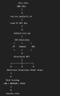
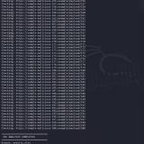

# Automated IOC Reputation Checker Using VirusTotal API

A SOC-focused cybersecurity automation project built with **Bash and Python** to analyze Indicators of Compromise (IOCs) such as IP addresses, domains, and URLs using the **VirusTotal API v3**.

## Project Objective

```text
IOC Dataset / Direct IOC
        |
        v
Bash Automation
        |
        v
Python IOC Analyzer
        |
        v
IP / Domain / URL Detection
        |
        v
VirusTotal API
        |
        v
Detection Statistics
        |
        v
Risk Classification
        |
        v
Excel Investigation Report
```

## Key Features

- IP address detection
- Domain detection
- URL detection
- Excel IOC dataset processing
- Direct single-IOC analysis
- VirusTotal API v3 integration
- Malicious / Suspicious / Harmless / Undetected results
- Simple SOC triage risk classification
- Excel report generation
- Bash automation
- Python automation
- Dry-run testing without API requests
- Environment-variable based API-key handling

## Technologies

- Kali Linux / Linux
- Bash
- Python 3
- VirusTotal API v3
- Pandas
- Requests
- OpenPyXL
- Microsoft Excel / LibreOffice Calc

## Project Structure

```text
Automated-IOC-Reputation-Checker/
|
├── scripts/
│   ├── main.py
│   └── ioc_checker.sh
|
├── dataset/
│   └── ioc_dataset_500_synthetic.xlsx
|
├── reports/
│   └── .gitkeep
|
├── screenshots/
│   ├── 01_terminal_ioc_processing.png
│   └── 02_virustotal_analysis.png
|
├── .env.example
├── .gitignore
├── PROJECT_INFO.txt
├── README.md
└── requirements.txt
```

## Dataset

The included dataset contains **500 synthetic/lab IOC records** for testing and demonstration.

The dataset includes:

- Record ID
- IP Address
- URL
- Anomaly Type
- Risk Level
- Status

The dataset is synthetic/lab data and must not be interpreted as confirmation that listed infrastructure is malicious.

## Kali Linux Setup

### 1. Clone the repository

```bash
git clone https://github.com/YOUR_USERNAME/Automated-IOC-Reputation-Checker.git
cd Automated-IOC-Reputation-Checker
```

### 2. Create a virtual environment

```bash
python3 -m venv .venv
```

If Kali reports that `venv` is unavailable:

```bash
sudo apt update
sudo apt install python3-venv
```

Then create the environment again:

```bash
python3 -m venv .venv
```

### 3. Activate the virtual environment

```bash
source .venv/bin/activate
```

### 4. Install dependencies

```bash
python -m pip install --upgrade pip
pip install -r requirements.txt
```

## Dry-Run Test

Test the complete processing workflow without making VirusTotal API requests:

```bash
python scripts/main.py \
  --input dataset/ioc_dataset_500_synthetic.xlsx \
  --dry-run \
  --output reports/dry_run_report.xlsx
```

## Bash Automation

Make the Bash launcher executable:

```bash
chmod +x scripts/ioc_checker.sh
```

Run:

```bash
./scripts/ioc_checker.sh \
  --input dataset/ioc_dataset_500_synthetic.xlsx \
  --dry-run \
  --output reports/bash_dry_run_report.xlsx
```

## VirusTotal API Configuration

Set your VirusTotal API key as an environment variable:

```bash
export VT_API_KEY="YOUR_VIRUSTOTAL_API_KEY"
```

Verify without displaying the key:

```bash
if [ -n "$VT_API_KEY" ]; then
    echo "VirusTotal API key is set"
else
    echo "VirusTotal API key is NOT set"
fi
```

Never commit the API key to GitHub.

## Run VirusTotal Analysis

Using Python:

```bash
python scripts/main.py \
  --input dataset/ioc_dataset_500_synthetic.xlsx \
  --output reports/virustotal_report.xlsx
```

Using Bash:

```bash
./scripts/ioc_checker.sh \
  --input dataset/ioc_dataset_500_synthetic.xlsx \
  --output reports/virustotal_report.xlsx
```

## Analyze a Single IOC

IP:

```bash
python scripts/main.py --ioc 8.8.8.8
```

Domain:

```bash
python scripts/main.py --ioc example.com
```

URL:

```bash
python scripts/main.py --ioc https://example.com/login
```

## Risk Classification

The project uses a simple triage rule for demonstration:

| Detection Result | Project Risk |
|---|---|
| 5 or more malicious detections | Critical |
| 1–4 malicious OR 2+ suspicious | High |
| 1 suspicious | Medium |
| No malicious/suspicious with benign evidence | Low |
| No usable result | Unknown |

This is a project-level triage rule and is not a substitute for an organization's incident-response process.

## SOC Use Case

1. Receive an IOC.
2. Identify whether it is an IP, domain, or URL.
3. Submit the IOC to threat intelligence.
4. Review vendor detection statistics.
5. Assign an initial triage risk.
6. Record the result.
7. Escalate or investigate according to organizational procedures.

## Security Notes

- Never hard-code API keys.
- Never upload API keys to GitHub.
- The included dataset is synthetic/lab data.
- VirusTotal results should be treated as threat-intelligence evidence and correlated with additional telemetry before response actions.
- Respect VirusTotal API quotas and terms.

## Screenshots

### Terminal IOC Processing



### VirusTotal Analysis



## Author

**Gowthambalaji M**

Cybersecurity / SOC Analyst Portfolio Project
